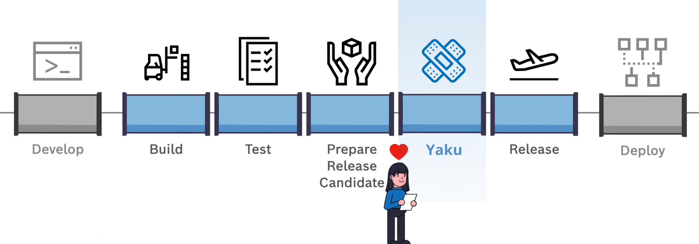
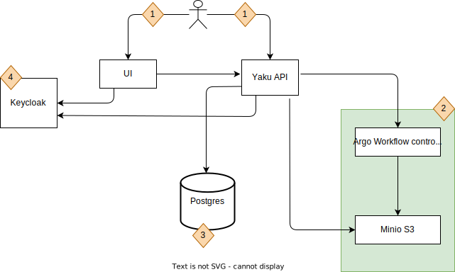

<!--
SPDX-FileCopyrightText: 2024 grow platform GmbH

SPDX-License-Identifier: MIT
-->

# Yaku

**!!THIS PROJECT IS UNDER CONSTRUCTION !!**

Yaku is a service to help you automate your software release process. It’s a tool, that automatically collects various files and attaches them as evidences to the related release questions and lets you know whether the questions’ requirements were met or not and why. Therefore, it allows you to speed up your software release preparation times by a substantial amount. This is achieved by configuring different autopilots that can:
- fetch and evaluate files, stored on various platforms like SharePoint
- fetch and evaluate tickets, managed in different platforms like Azure DevOps
- verify signatures in pdf documents
- and much more…

You can also provide manual answers for the questions that can not be automated. So you have all of your quality assessment-related content in one place.

## User Documentation

If you have already deployed Yaku, start by reviewing the [user documentation](https://b-s-f.github.io/yaku/).

## Components

The image below illustrates the components of Yaku and their interactions.

1. **User Interaction**: Users can interact with Yaku via the UI or API, allowing CI pipeline integration.
2. **Workflow Engine**: Utilizes Argo Workflows for orchestrating QG assessment jobs on Kubernetes. Argo Workflows is included as a sub-chart in the Yaku Helm chart. Learn more about [Yaku core API Argo workflows](./documentation/core-api.md#argo-workflows).
3. **Database**: Yaku core API uses PostgreSQL, with a default database named `yaku`. A PostgreSQL container is included in the Helm chart.

   **Note:**
    - The default database `yaku` cannot be changed unless using a custom PostgreSQL server.
    - The default username is **postgres**, stored in the Kubernetes secret **yaku-default-postgres-creds**.
    - For production, a suitable PostgreSQL database is recommended. More details in the [Yaku core API database](./documentation/core-api.md#database).

4. **Access Management**: Yaku uses Keycloak for access management, supporting OpenID Connect and SAML2. Refer to the [Keycloak configuration guide](./documentation/configure-keycloak.md) for setup instructions. A basic deployment guide is also available [here](./documentation/deploy-keycloak.md).

## Operator Guide

The operator documentation is located in the `documentation/` folder.
Refer to the [Yaku Operator Guide](./documentation/operator-guide.md) for installation and operation instructions.
It also contains [known issues](./documentation/known_issues.md) that you might face with Yaku deployment.

## Development

For developer documentation, see [DEVELOPMENT.md](./DEVELOPMENT.md).

## Licenses

See the [LICENSES](./LICENSES) folder for project licenses.
