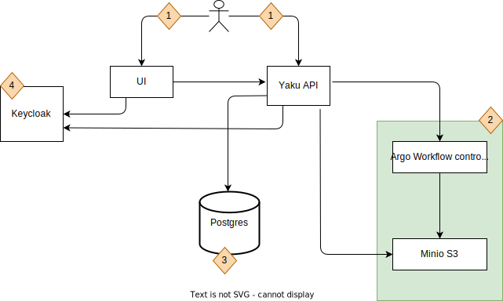

# Yaku On-premise Deployment Guide

This document provides an overview of Yaku's components and guides you through the steps required to deploy your Yaku instance.

## Introduction

Let's start by looking at the components you'll be deploying as part of Yaku.

The image below shows the different components that run as part of Yaku and how they interact with each other.

1. A user can interact with Yaku either via the UI or by directly sending requests to the API, enabling runs to be started from CI pipelines as well.
2. Yaku uses Argo Workflows as a workflow engine for orchestrating QG assessment jobs on Kubernetes. The Argo Workflows is included as a sub chart of Yaku helm chart. Read more about [Yaku core API Argo workflows](./core-api.md#argo-workflows).
3. Yaku core API stores data in PostgreSQL in a database called `yaku`. A PostgreSQL container is included in the Yaku helm chart with this database created.

   **NOTE:**
    - This container has the database `yaku` created by default. Therefore, you can't change the `DB_NAME` unless you configure your own production PostgreSQL server.
    - When using this PostgreSQL container included in the deployment, the username to connect to all databases in the container can only be **postgres**. This username is stored in the default Kubernetes secret **yaku-default-postgres-creds** that is created with the Yaku helm chart.
    - This container can be used to get familiar with the service, but you will need a production-suitable PostgreSQL database afterwards. Read more about [Yaku core API database](./core-api.md#database).
4. Yaku uses Keycloak for access management. It can be configured with OpenID Connect and SAML2 identity providers. Check [Keycloak configuration guide](./configure-keycloak.md) to learn how to configure your Keycloak instance. If you don't have a Keycloak instance in your organization that you can use, we provide [a guide for a basic deployment of Keycloak](./deploy-keycloak.md).

## What do I get

The Yaku Helm chart that you receive can be installed on any Kubernetes cluster. Furthermore, the chart zip file contains other release-related files such as the Yaku Changelog, a list of all apps' versions included in the release, yaku-cli zip file and the deployment guides.

The chart contains all components (API and UI) and all required dependencies (Argo workflows, MinIO, PostgreSQL, etc.). We packaged the dependencies as subcharts so you can run Yaku out-of-the-box quickly. The dependencies are there to get you started with using Yaku, but once you want to use it in production, we recommend deploying the dependencies separately to be production-ready or use hosted solutions that your enterprise provides.

## Before you start checklist

Before you start, you need:

- A Kubernetes cluster with admin access and with the following minimum free resources available:
    - 64 GB of memory
    - 8 CPU cores
    - Free storage if you'll be using persistent storage
- A namespace where you'll deploy Yaku.
- A Docker pull Kubernetes secret, with the value of the access token to Yaku's Azure container registry, created in the namespace.
- A Kubernetes secret for yaku service secret objects encryption is created. This value is needed to encrypt sensitive data stored in the db. Learn [here](./core-api.md#encryption-keys) why you need that. If you want to try Yaku in a playground setup, you can skip this requirement. This will generate a predefined encryption key which you can use. We recommend that you create your own value and deploy it as kuberenets secret, then add the kubernetes secret info in values file under `encryption_secret_name` and `encryption_secret_key` 
- Helm deployment values are configured. All configurations are documented in the **values.yaml** file.

