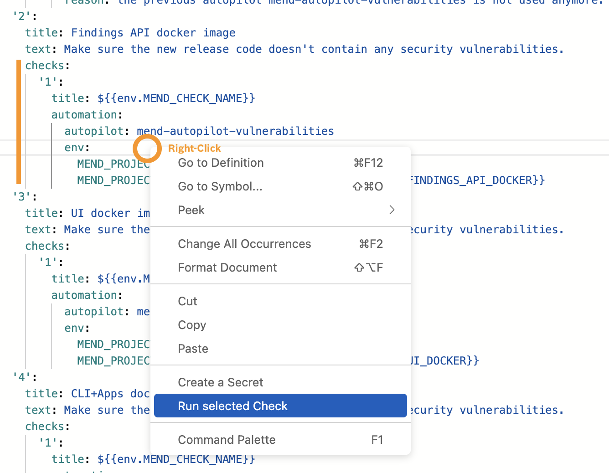
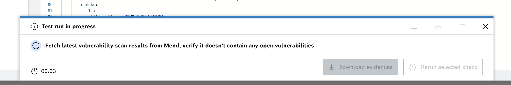
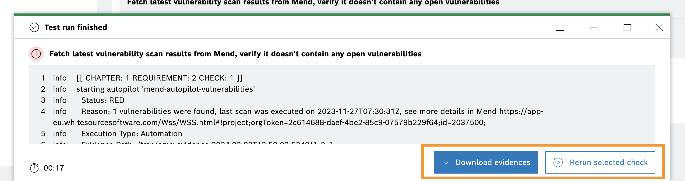
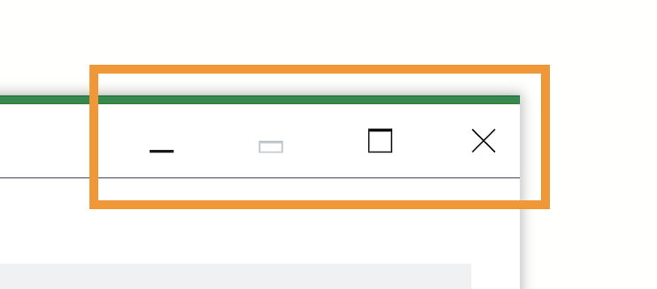
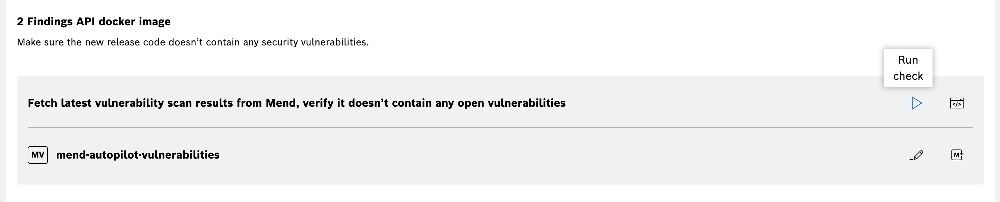
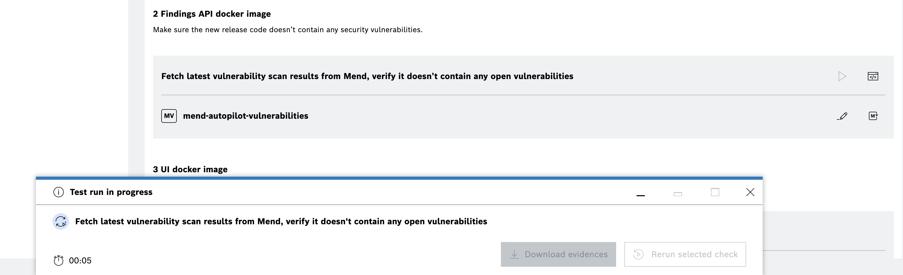

<!--
SPDX-FileCopyrightText: 2024 grow platform GmbH

SPDX-License-Identifier: MIT
-->

# Test Space for Autopilots

In some cases, the run of a full configuration can take several minutes. This can be especially cumbersome if you are working on a specific check within the configuration and only want to test if it works as expected.
{{ PNAME }} therefore allows to execute a run for a single check/requirement. This run will then skip all other checks and will only display the result for the selected check.

There are two options to initiate a run for a specific check (test run):

## How to start a test run in the code editor

1. Right-click inside the code lines of a check and select {guilabel}`Run selected Check` in the context menu.

   

2. The test run panel opens at the bottom of the screen and gives an indication that the test run is in progress. You can see at the lower left corner how long the execution of the test run takes.

   

3. As soon as the test run is finished, you can see the results and the logs of the check within the test run panel. The counter at the lower left corner has stopped and the buttons in the lower right corner get enabled. They allow you to download the evidence files (including logs and results) or to rerun the check again.

   

4. You can change the size of the test run panel with the functions in the top right corner of the panel, e.g. increase the size of the test run panel to have more space available to see the logs or to minimize the size of the panel to work on the code in the background.

   

## How to start a test run in the visual editor

1. To start a test run in the visual editor, click on the triangle icon in the check element. The functions will appear as soon as you hover over the element.

   

2. This triggers the same test run panel as described above.

   
